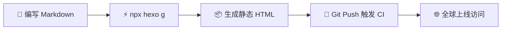

本文集中展示了 Hexo 与 NexT 主题内置的各类高颜值排版组件，包括 **Note 提示盒、Tabs 多标签页、可折叠提示框、炫彩按钮、Mermaid 流程图、LaTeX 数学公式** 等，供写作时参考与复制。

<!-- more -->

## 1. Note 提示呼出框（五彩提示条）

用于强调关键信息、注意事项、警告或成功状态：


**默认提示（Default）**：一段普通的补充说明文字，适用于常规注释。



**信息提示（Info）**：当前博客已开启现代化半透明毛玻璃卡片与射线罗盘背景调节面板。



**成功提示（Success）**：恭喜！GitHub Actions 自动化部署工作流已成功就绪。



**警告提示（Warning）**：修改根目录的 `_config.yml` 配置文件后，需重启本地 Hexo 服务方可生效。



**危险提示（Danger）**：请勿随意在本地执行不可逆的文件删除命令！


---

## 2. Tabs 多标签页切换组件

在同一个卡片区域内无缝切换多平台命令或多种代码语言：


<!-- tab Windows (PowerShell) -->
```powershell
# 1. 启动本地实时预览
npx hexo s

# 2. 提交推送到 GitHub
git add .
git commit -m "feat: 发布新文章"
git push
```
<!-- endtab -->

<!-- tab macOS / Linux (Bash) -->
```bash
# 1. 启动本地预览
npx hexo server

# 2. 提交推送
git add .
git commit -m "feat: publish post"
git push
```
<!-- endtab -->

<!-- tab 快捷指令对照表 -->
| 场景 | 简写命令 | 完整命令 |
| :--- | :--- | :--- |
| **本地预览** | `hexo s` | `hexo server` |
| **编译生成** | `hexo g` | `hexo generate` |
| **新建博文** | `hexo n` | `hexo new` |
<!-- endtab -->


---

## 3. Fold 折叠面板 / 详情抽屉

适合收纳超长的配置文件、系统日志或次要参考信息：


```yaml
# 示例配置片段展示
theme: next
language: zh-CN
timezone: Asia/Shanghai

url: https://hammerers.github.io
permalink: :year/:month/:day/:title/

# 搜索插件配置
search:
  path: search.json
  field: post
  content: true
  format: html
```
> 💡 **提示**：折叠内容平时保持收拢，使文章主干更加紧凑干净！


---

## 4. 炫彩操作按钮（Button）

用于引导读者跳转外链、下载资源或访问仓库：







---

## 5. Label 行内彩色徽章

在段落文字中凸显状态、版本号与关键词：

- 推荐使用博客内核版本  与主题版本 ；
- 该特性处于  状态，请勿降级至 。

---

## 6. Mermaid 动态矢量流程图

纯代码驱动绘制，自适应深浅色主题：



---

## 7. LaTeX 科学数学公式

支持行内公式如质能方程 $E = mc^2$，以及独立高斯积分大公式：

$$\int_{-\infty}^{+\infty} e^{-x^2} \, dx = \sqrt{\pi}$$

$$\sum_{n=1}^{\infty} \frac{1}{n^2} = \frac{\pi^2}{6}$$

---

## 8. 数据表格与代办清单

| 功能模块 | 启用状态 | 说明 |
| :--- | :---: | :--- |
| **毛玻璃透明卡片** | ✅ 已开启 | `0.3` 通透度 + 高斯模糊 |
| **射线罗盘设置面板** | ✅ 已开启 | 左下角贴边顺时针旋转转盘 |
| **GitHub 头像实时关联** | ✅ 已开启 | 悬停 3D 向上浮起放大 |

- [x] 搭建 Hexo + NexT 基础博客系统
- [x] 配置全屏动态壁纸与毛玻璃卡片
- [x] 实现左下角 90° 射线罗盘背景调节器
- [ ] 撰写更多精彩技术分享与生活随笔
